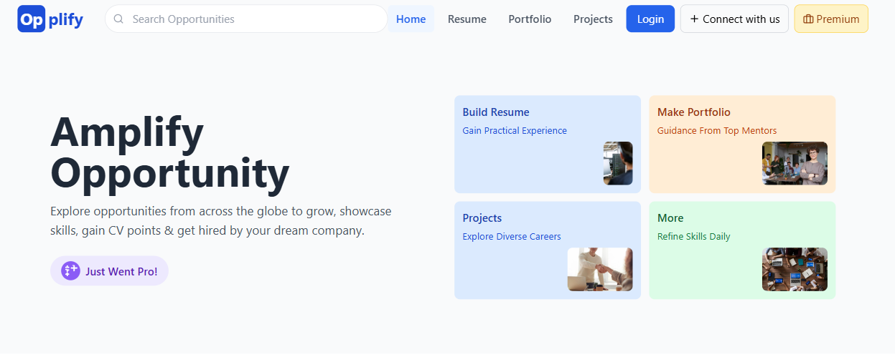
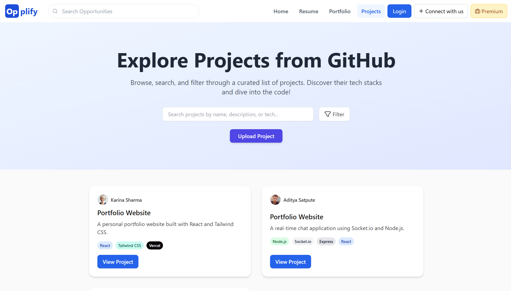
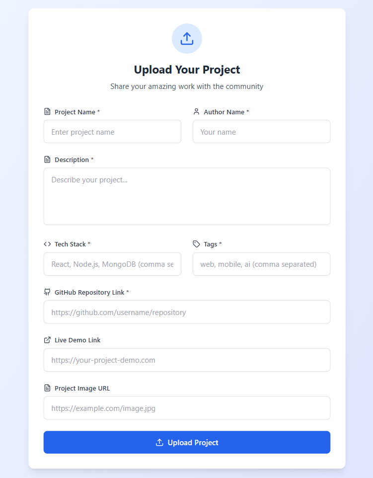

# Opplify – Empowering Project and Discovery

Opplify is a dynamic web platform built to help developers and students showcase their projects, discover others’ work, and connect based on technology, interest, and domain. Whether you're a beginner looking for inspiration or an experienced developer seeking collaboration, Opplify provides the perfect space to grow and contribute.

---

## Table of Contents

- [Features](#-features)
- [Screenshots](#-screenshots)
- [Tech Stack](#-tech-stack)
- [Installation & Setup](#️-installation--setup)
- [Folder Structure](#-folder-structure)
- [API Endpoints](#-api-endpoints)
- [Contributing](#-contributing)
- [License](#-license)
- [Contact](#-contact)

---

## Features

 Current functionality includes:

-  Upload development projects with:
-  Title, Description, GitHub Link, Tech Stack, Domain, Difficulty
-  View a list of all uploaded projects
-  Filter projects by Tech Stack, Domain, and Difficulty
-  Clean, fast and responsive frontend using React
-  Backend API with Express.js and MongoDB
-  Tags displayed for each tech stack
-  Organized UI (Tailwind CSS)

---

## Screenshots

### Opplify Home Page


### Explore Project Page  


### Project Listing Page  


---

## Tech Stack

### Frontend:
- React (Vite)
- Axios
- Tailwind CSS / Material UI
- React Router DOM

### Backend:
- Node.js
- Express.js
- MongoDB with Mongoose
- dotenv, cors, nodemon

---

## Installation & Setup

### Clone the Repository

```bash
git clone https://github.com/Aditya-satpute/Opplify.git
cd opplify

```
### Frontend Setup :
```bash
cd frontend
npm install
npm run dev
```
### Backend Setup
```bash
cd backend
npm install
npm run dev
```
- Make sure to create a .env file inside backend/ with:

PORT=5000
MONGO_URI=your_mongo_connection_string

## Folder Structure
```plaintext
Opplify/
│
├── frontend/                     # React frontend
│   ├── public/                   # Static assets (HTML, etc.)
│   └── src/                      # Source code
│       ├── app/                  # Main app configuration (e.g., routes, providers)
│       ├── components/           # Reusable UI components
│       ├── hooks/                # Custom React hooks
│       ├── pages/                # Page-level components (e.g., Home, Upload)
│       ├── routes/               # Route definitions and navigation logic
│       ├── service/              # API service handlers (e.g., axios wrappers)
│       ├── utils/                # Utility functions (e.g., formatters, validators)
│       └── main.jsx              # Entry point for the React app
│
├── server/                      # Node.js + Express backend
│   ├── models/                  # Mongoose models (Project, User, etc.)
│   ├── routes/                  # API route definitions
│   ├── .env                     # Environment variables (Mongo URI, etc.)
│   └── index.js                 # Main backend entry file (Express server)
│
└── README.md                     # Project documentation (this file)
```
## API Endpoints

> Base URL for all API requests: `http://localhost:5000/api`

### Project Routes

| Method | Endpoint         | Description                         |
|--------|------------------|-------------------------------------|
| GET    | `/projects`      | Get all uploaded projects           |
| POST   | `/projects`      | Upload a new project                |

## Contributing

We love your input! Follow these steps to contribute:

1. Fork the repo: `git clone https://github.com/Aditya-satpute/Opplify.git`
2. Create your feature branch: `git checkout -b feature/my-feature`
3. Make changes and commit: `git commit -m "Add my feature"`
4. Push to your branch: `git push origin feature/my-feature`
5. Open a Pull Request on GitHub

---

Please:
-  Search existing issues before creating new ones
-  Write tests for new features (if applicable)
-  Keep code style consistent

Thanks for helping make Opplify better! 

## License

This project is licensed under the [MIT License](./LICENSE).

## Contact

If you have any questions, feedback, or suggestions, feel free to reach out:

- Email: [adityasatpute402@gmail.com](mailto:adityasatpute402@gmail.com)
- LinkedIn: [https://www.linkedin.com/in/aditya-satpute-b46831291/](https://www.linkedin.com/in/aditya-satpute-b46831291/)
- GitHub: [https://github.com/Aditya-satpute](https://github.com/Aditya-satpute)

We’d love to hear from you!
